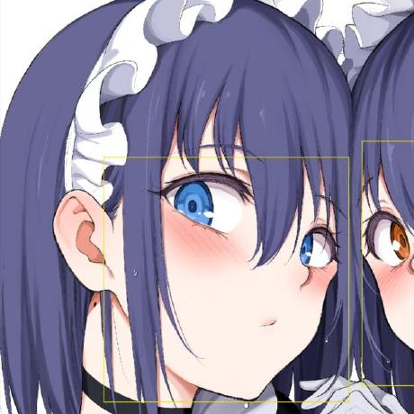
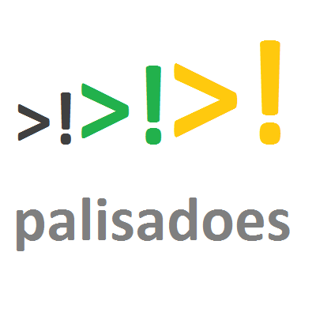
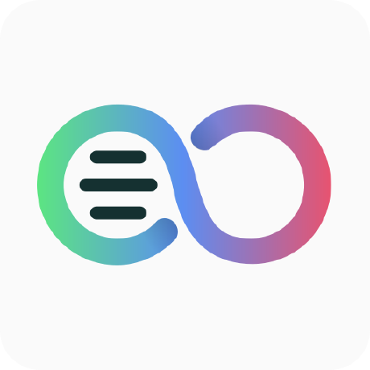
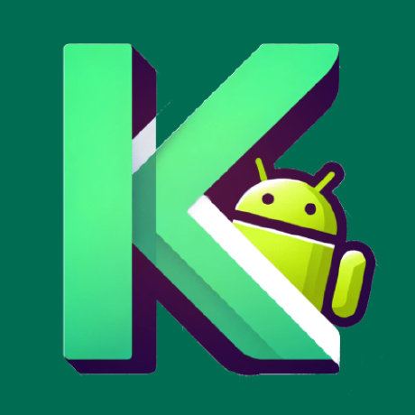

# Awesome Open Source Android Apps 

---

🔒 Privacy 

 

<table width="100%">
<tr>
<td width="33%">
  

    
    <h3>NetGuard</h3>
    <code>[Firewall]</code>
     
    
Simple way to block access to the internet per application.

    
  

</td>
<td width="33%">
  

    
    <h3>TrackerControl</h3>
    <code>[Privacy]</code>
     
    
Monitor and control all tracking from your apps.

    
  

</td>
<td width="33%">
  

    
    <h3>Tor Browser</h3>
    <code>[Browser]</code>
     
    
Experience real private browsing without tracking.

    
  

</td>
</tr>
<tr>
<td width="33%">
  

    
    <h3>ToolNeuron</h3>
    <code>[PRIVACY]</code>
     
    
Complete offline AI ecosystem for Android: Chat (GGUF/LLM...

    
  

</td>
<td width="33%">
  

    
    <h3>Urik</h3>
    <code>[PRIVACY]</code>
     
    
Privacy-focused Android keyboard with swipe typing, custo...

    
  

</td>
<td width="33%">
  

    
    <h3>Flux</h3>
    <code>[PRIVACY]</code>
     
    
Flux: Jetpack Compose with Material 3, MVI based applicat...

    
  

</td>
</tr>
<tr>

<td width="33%">
  

    
    <h3>Monica</h3>
    <code>[PRIVACY]</code>
     
    
Password Management, 2FA Generator

    
  

</td>
<td width="33%">
  <!-- Empty cell to maintain grid -->
</td>
<td width="33%">
  <!-- Empty cell to maintain grid -->
</td>
</tr>
</table>

▶️ Media 

 

<table width="100%">
<tr>
<td width="33%">
  

    
    <h3>NewPipe</h3>
    <code>[YouTube]</code>
     
    
The lightweight YouTube experience for Android.

    
  

</td>
<td width="33%">
  

    
    <h3>Fossify Gallery</h3>
    <code>[Photos]</code>
     
    
A simple gallery with no ads or unnecessary permissions.

    
  

</td>
<td width="33%">
  

    
    <h3>VLC</h3>
    <code>[Player]</code>
     
    
The best open source media player for Android.

    
  

</td>
</tr>
<tr>

<td width="33%">
  

    
    <h3>tempus</h3>
    <code>[MEDIA]</code>
     
    
An open source and lightweight music client for Subsonic,...

    
  

</td>
<td width="33%">
  <!-- Empty cell to maintain grid -->
</td>
<td width="33%">
  <!-- Empty cell to maintain grid -->
</td>
</tr>
</table>

⚙️ System 

 

<table width="100%">
<tr>
<td width="33%">
  

    
    <h3>Termux</h3>
    <code>[Terminal]</code>
     
    
Terminal emulator and Linux environment app.

    
  

</td>
<td width="33%">
  

    
    <h3>KeePassDX</h3>
    <code>[Security]</code>
     
    
Multiformat password manager for Android.

    
  

</td>
<td width="33%">
  

    
    <h3>F-Droid</h3>
    <code>[Store]</code>
     
    
Install Free and Open Source Applications (FOSS).

    
  

</td>
</tr>
<tr>
<td width="33%">
  

    
    <h3>talawa</h3>
    <code>[SYSTEM]</code>
     
    
Community Organization Management Software. Click on the ...

    
  

</td>
<td width="33%">
  

    
    <h3>Notes</h3>
    <code>[SYSTEM]</code>
     
    
A simple text field for adding quick notes without ads.

    
  

</td>
<td width="33%">
  

    
    <h3>dragon-store</h3>
    <code>[SYSTEM]</code>
     
    
Dragon Store is your gateway to transparent, libre and fr...

    
  

</td>
</tr>
<tr>
<td width="33%">
  

    
    <h3>online</h3>
    <code>[SYSTEM]</code>
     
    
Collabora Online is a collaborative online office suite b...

    
  

</td>
<td width="33%">
  

    
    <h3>WeatherMaster</h3>
    <code>[SYSTEM]</code>
     
    
A Weather app for android 🌦🌞☔

    
  

</td>
<td width="33%">
  

    
    <h3>news-android</h3>
    <code>[SYSTEM]</code>
     
    
📱🗞️ Android client for the Nextcloud news/feed reader app

    
  

</td>
</tr>
<tr>
<td width="33%">
  

    
    <h3>oss-weather</h3>
    <code>[SYSTEM]</code>
     
    
An OSS weather app for iOS/Android

    
  

</td>
<td width="33%">
  

    
    <h3>android</h3>
    <code>[SYSTEM]</code>
     
    
📱 Nextcloud Android app

    
  

</td>
<td width="33%">
  

    
    <h3>DiligentFX</h3>
    <code>[SYSTEM]</code>
     
    
High-level rendering components

    
  

</td>
</tr>
<tr>
<td width="33%">
  

    
    <h3>Keyboard</h3>
    <code>[SYSTEM]</code>
     
    
Easy keyboard for inserting all kinds of texts, special c...

    
  

</td>
<td width="33%">
  

    
    <h3>commons</h3>
    <code>[SYSTEM]</code>
     
    
Some helper functions and shared resources used by the Fo...

    
  

</td>
<td width="33%">
  

    
    <h3>Voice-Recorder</h3>
    <code>[SYSTEM]</code>
     
    
An easy way of recording any discussion or sounds without...

    
  

</td>
</tr>
<tr>
<td width="33%">
  

    
    <h3>Phone</h3>
    <code>[SYSTEM]</code>
     
    
A handy phone call manager with phonebook, number blockin...

    
  

</td>
<td width="33%">
  

    
    <h3>Paint</h3>
    <code>[SYSTEM]</code>
     
    
A canvas you can draw on with different colors.

    
  

</td>
<td width="33%">
  

    
    <h3>Messages</h3>
    <code>[SYSTEM]</code>
     
    
An easy and quick way of managing SMS and MMS messages wi...

    
  

</td>
</tr>
<tr>

<td width="33%">
  

    
    <h3>timer-machine-android</h3>
    <code>[SYSTEM]</code>
     
    
⏲ A highly customizable interval timer app for Android

    
  

</td>
<td width="33%">
  <!-- Empty cell to maintain grid -->
</td>
<td width="33%">
  <!-- Empty cell to maintain grid -->
</td>
</tr>
</table>

🚀 Launchers

 

<table width="100%">
<tr>
<td width="33%">
  

    
    <h3>Neo Launcher</h3>
    <code>[Modern]</code>
     
    
A modern, customizable and performant launcher.

    
  

</td>
<td width="33%">
  

    
    <h3>KISS Launcher</h3>
    <code>[Minimal]</code>
     
    
Blazingly fast launcher that searches through your apps.

    
  

</td>
<td width="33%">
  

    
    <h3>mLauncher</h3>
    <code>[LAUNCHERS]</code>
     
    
Minimal Launcher app for Android. Customized olauncher as...

    
  

</td>
</tr>
<tr>
<td width="33%">
  

    
    <h3>ComposeMediaPlayer</h3>
    <code>[LAUNCHERS]</code>
     
    
Compose Media Player is a video player library designed f...

    
  

</td>

<td width="33%">
  

    
    <h3>Github-Store</h3>
    <code>[LAUNCHERS]</code>
     
    
A free, open-source app store for GitHub releases — brows...

    
  

</td>
<td width="33%">
  <!-- Empty cell to maintain grid -->
</td>
</tr>
</table>

 

  

